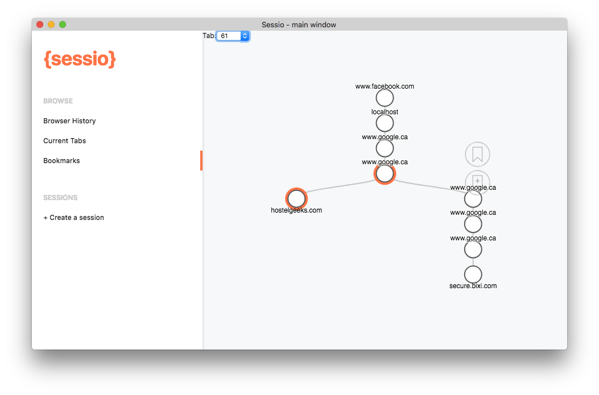

# Sessio Chrome Extension (in Development)
> Sessio is a chrome extension that allows the user to harness the power of his browsing history and improves the visualisation and shareability of the chrome bookmarks.

## Table of Contents

- [Background](#background)
- [Install](#install)
- [Contribute](#contribute)
- [License](#license)

## Security

### Any optional sections

## Background

### Any optional sections

## Install


```

```

### Any optional sections

## Usage

```
```

### Any optional sections

## API

### Any optional sections

## More optional sections

## Contribute

See [the contribute file](contribute.md)!

PRs accepted.

Small note: If editing the Readme, please conform to the [standard-readme](https://github.com/RichardLitt/standard-readme) specification.

### Any optional sections

## License

[MIT © Jordaycs](../LICENSE)
